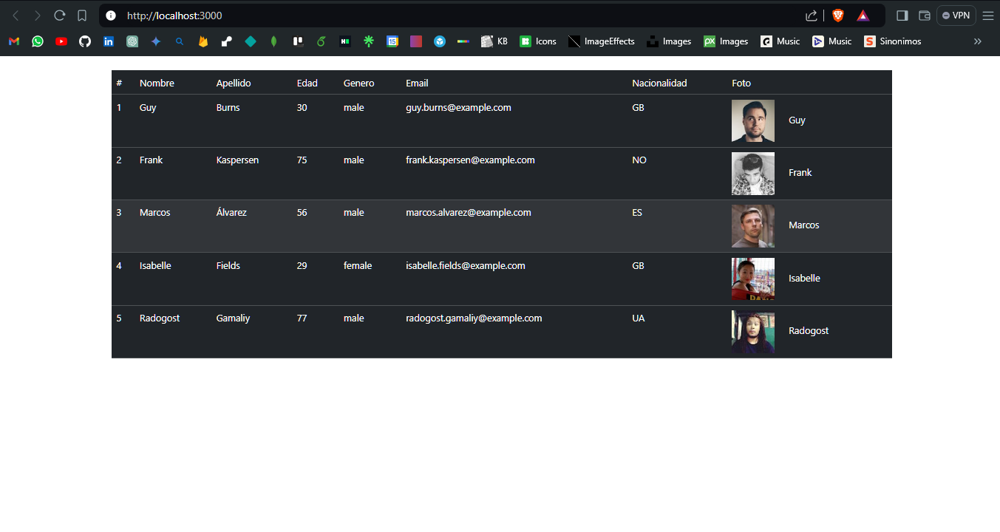

# Primer paso

Enfoque Frontend (Debido a que se esta utilizando un api - servicio de datos, y por lo
tanto no es necesario el uso del api)

## Segundo paso

Preparacion de ambiente, en este paso se configuro el proyecto para que pueda implementarse
el servicio con react js

### Tercer paso

Consumir el servicios de datos, en este caso se uso el enfoque de uso de una libreria abierta
axios, la cual permite realizar requests de manera optimizada y sencilla

### Cuarto paso

Seleccionar los datos solicitados, en este paso, debido a la cantidad de datos que entrega
el servicio es necesario seleccionar solamente los datos requeridos.

### Quinto y ultimo paso

Implementar la vista de de los usuarios, mediante un diseño de tabla de datos para mostrar
por medio de la interfaz principal.

>>> INTERFAZ

